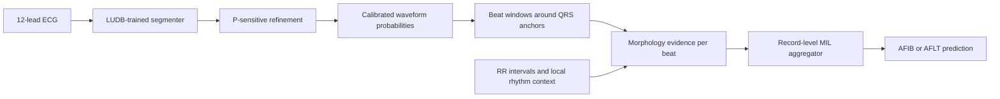

# CoMET-MIL

**Co**ntextual **M**orphology **E**vidence **T**ransfer with record-level
**M**ultiple-**I**nstance **L**earning.

This repo implements a two-stage ECG transfer pipeline for AFIB/AFLT
classification:

```text
LUDB waveform delineation -> refined morphology teacher -> PTB-XL record classifier
```

The central idea is simple:

- do not force segmentation and classification to share one raw-ECG backbone
- first learn a strong waveform teacher
- then transfer explicit beat-wise morphology evidence plus RR context
- let a record-level MIL head learn which beats matter most

## Method At A Glance

CoMET-MIL has four kept stages:

1. Base segmenter on LUDB
2. P-sensitive segmenter refinement on LUDB
3. Calibrated beat-evidence extraction from the refined segmenter
4. Record-level MIL classification on PTB-XL

## Sampling-Rate Rule

All public commands now follow the same rule:

- if the waveform file exposes `record.fs`, that value is used as the source
  sampling rate
- if the file does not expose `record.fs`, you must pass `--source-fs`
- if neither exists, the command fails with an explicit error

There is no hidden fallback source sampling rate.

## Logic Map



## Why This Method Exists

A naive joint model can blur two different tasks:

- waveform delineation asks where `P`, `QRS`, and `T` waves are
- rhythm classification asks which beats and timing patterns imply AFIB/AFLT

CoMET-MIL separates them on purpose:

- the segmenter specializes in morphology
- the classifier consumes explicit morphology evidence
- the MIL head learns which beats deserve higher weight

That gives a more interpretable transfer path:

```text
ECG
-> delineation probabilities
-> beat-wise morphology evidence + RR context
-> record prediction
```

## Contributions

This work makes five main contributions relative to the original
segmentation-guided lineage:

1. **CoMET-MIL**, a morphology-first ECG transfer pipeline that separates
   waveform delineation from record-level AFIB/AFLT classification instead of
   forcing both tasks into a single shared raw-ECG backbone. This is the main
   methodological contribution relative to the original segmentation-guided lineage summarized in
   [REFERENCES.md](REFERENCES.md) as
   `R1`.
2. A **P-sensitive segmenter refinement objective** that explicitly improves
   pre-QRS atrial evidence by rewarding correct P-wave overlap where it should
   exist and penalizing false P evidence where it should not. This is the main
   task-specific refinement contribution added on top of `R1`.
3. An **explicit beat-wise evidence transfer scheme** that moves calibrated
   morphology evidence and RR context from the refined segmenter into the
   downstream classifier, rather than relying on shallow pooled summaries. This
   is the repo's main transfer-structure contribution beyond the original shared
   coupling setup in `R1`.
4. A **record-level MIL aggregation head** that learns which beats are most
   informative for AFIB/AFLT prediction, instead of treating all beats equally.
   This aggregation choice is methodologically aligned with the MIL reference
   listed as `R4`.
5. An **external PTB-XL transfer and sampling-rate robustness study** showing
   that the method transfers beyond LUDB and that a `500 Hz` input space is the
   preferred operating regime. This external validation setup is grounded
   in the PTB-XL references listed as `R2` and `R3`.

## What Improves At Each Stage

| Stage | What is added | Why it helps |
|---|---|---|
| Base segmenter | dense waveform supervision on LUDB | gives a usable morphology teacher |
| P-sensitive refinement | pre-QRS P-presence and P-absence pressure | improves the evidence most relevant to AFIB/AFLT |
| Calibrated evidence transfer | temperature-scaled probabilities plus RR context | makes downstream features more stable and clinically meaningful |
| Record-level MIL | learnable beat weighting | avoids treating all beats as equally informative |

## Insight Map

| Question | What was done | Finding |
|---|---|---|
| Is the task itself valid? | compared oracle morphology evidence against predicted evidence | oracle evidence was near-ceiling, so the problem is solvable |
| Where is the bottleneck? | swapped oracle and predicted teachers | the bottleneck is teacher quality, not label definition |
| Does transfer structure matter? | compared pooled summaries against beat-wise evidence with context | explicit beat evidence is better than shallow pooling |
| Does segmentation quality matter downstream? | refined only the segmenter and kept the classifier structure fixed | better P-sensitive delineation improves final classification |
| What record head should be kept? | compared simpler pooling against MIL | MIL is the strongest final record head |
| Does sampling rate matter? | compared native `100 Hz`, `100 -> 500 Hz`, and native `500 Hz` | the method clearly prefers a `500 Hz` input space |

## Key Results

### Full Kept Pipeline

This is the strong packaged result currently used in the repo.

| PTB-XL source | Model input fs | Balanced acc | Precision | F1 | MCC | PR-AUC | Pos recall | Neg recall |
|---|---:|---:|---:|---:|---:|---:|---:|---:|
| `records100` | `500` | 0.9423 | 0.7647 | 0.8314 | 0.8178 | 0.9317 | 0.9108 | 0.9737 |

### Robustness Plot: Sampling Rate

`records100` means the native PTB-XL `100 Hz` files.  
`records500` means the native PTB-XL `500 Hz` files.  
`Model input fs` is the sampling rate actually used by the model after any
resampling.

| PTB-XL source | Model input fs | Balanced acc | F1 | MCC |
|---|---:|---:|---:|---:|
| `records100` | `100` | 0.5240 | 0.1429 | 0.0547 |
| `records100` | `500` | 0.8837 | 0.6364 | 0.6088 |
| `records500` | `500` | 0.8913 | 0.6667 | 0.6391 |

Balanced accuracy:

```text
records100 -> 100 Hz  | ##########################                        | 0.5240
records100 -> 500 Hz  | ############################################      | 0.8837
records500 -> 500 Hz  | #############################################     | 0.8913
```

F1 score:

```text
records100 -> 100 Hz  | #######                                           | 0.1429
records100 -> 500 Hz  | ################################                  | 0.6364
records500 -> 500 Hz  | #################################                 | 0.6667
```

MCC:

```text
records100 -> 100 Hz  | ###                                               | 0.0547
records100 -> 500 Hz  | ##############################                    | 0.6088
records500 -> 500 Hz  | ################################                  | 0.6391
```

### What These Plots Mean

- native `100 Hz` is too weak for this pipeline
- using the same `records100` files but upsampling them to `500 Hz` recovers
  most of the lost performance
- native `records500 -> 500 Hz` remains the cleanest and best setting

So the deployment rule is:

```text
best:    records500 -> 500 Hz
fallback: records100 -> 500 Hz
avoid:   records100 -> 100 Hz
```

## Detailed Explanation

### 1. Segmenter

The segmenter is trained on LUDB to predict dense waveform labels:

```text
P wave / QRS / T wave / background
```

This stage is not a classifier. Its only job is to become a reliable morphology
teacher.

### 2. P-Sensitive Refinement

AFIB/AFLT depends heavily on whether pre-QRS atrial evidence is present,
suppressed, or disorganized. The refinement stage therefore pushes the teacher
to behave better in the pre-QRS region:

- reward correct P evidence where it should exist
- penalize false P evidence where it should not exist

This is why the kept upstream model is the refined segmenter, not the earlier
base segmenter.

### 3. Evidence Transfer

The refined segmenter is frozen and reused as a teacher. For each beat, the
pipeline extracts:

- calibrated morphology evidence from the segmenter probabilities
- local RR and rhythm context

This converts raw ECG into a structured beat-level representation.

### 4. Record-Level MIL

The final classifier does not see the raw ECG directly. It sees a sequence of
beat-level evidence vectors and learns which beats deserve high attention.

That is important because not every beat in a record contributes equally to the
final rhythm label.

## Use

```bash
python -m venv .venv
source .venv/bin/activate
pip install -r requirements.txt
```

LUDB path:

```text
../public_dataset/physionet.org/files/ludb/1.0.1/data
```

PTB-XL path:

```text
../public_dataset/physionet.org/files/ptb-xl/1.0.3
```

Download:

```bash
.venv/bin/python download_ludb.py --output-dir ../public_dataset/physionet.org/files/ludb/1.0.1/data
.venv/bin/python download_ptbxl.py --output-dir ../public_dataset/physionet.org/files/ptb-xl/1.0.3 --codes AFIB AFLT SR --resolutions 100
```

If you also want the native `500 Hz` PTB-XL path for robustness testing:

```bash
.venv/bin/python download_ptbxl.py --output-dir ../public_dataset/physionet.org/files/ptb-xl/1.0.3 --codes AFIB AFLT SR --resolutions 100 500
```

Explicit source-rate examples:

```bash
.venv/bin/python train.py base \
  --data_dir ../public_dataset/physionet.org/files/ludb/1.0.1/data \
  --output_dir runs/step2-base-segmenter \
  --source-fs 500 \
  --target-fs 500
```

```bash
.venv/bin/python train.py refine \
  --data_dir ../public_dataset/physionet.org/files/ludb/1.0.1/data \
  --seg-checkpoint runs/step2-base-segmenter/best_seg_model.pt \
  --output_dir runs/step3-refined-segmenter \
  --source-fs 500 \
  --target-fs 500
```

```bash
.venv/bin/python evaluate.py \
  --data_dir ../public_dataset/physionet.org/files/ludb/1.0.1/data \
  --seg-checkpoint runs/step4-ptbxl-classifier/best_seg_model.pt \
  --output_dir runs/step5-ludb-eval \
  --source-fs 500 \
  --target-fs 500 \
  --plot-limit 12
```

```bash
.venv/bin/python infer.py \
  --data_dir ../public_dataset/physionet.org/files/ptb-xl/1.0.3 \
  --seg-checkpoint runs/step3-refined-segmenter/best_seg_model.pt \
  --modes record_mil_ctx_cal \
  --output_dir runs/step4-ptbxl-classifier \
  --ptbxl-resolution 100 \
  --source-fs 100 \
  --target-fs 500
```

For datasets whose waveform files do not expose `record.fs`, pass
`--source-fs` explicitly on `train.py`, `evaluate.py`, and `infer.py`.

The shipped scripts are now explicit:

```text
LUDB: --source-fs 500
PTB-XL records100: --source-fs 100
PTB-XL records500: --source-fs 500
```

Train the full kept pipeline:

```bash
bash scripts/run_full_pipeline_train_eval.sh
```

Or run each stage:

```bash
bash scripts/step2_train_base_segmenter.sh
bash scripts/step3_refine_segmenter.sh
bash scripts/step4_train_ptbxl_classifier.sh
bash scripts/step5_evaluate_ludb.sh
bash scripts/step6_infer_ptbxl.sh
```

Sampling-rate robustness:

```bash
bash scripts/run_ptbxl_sampling_robustness.sh
```

Main checkpoints after training:

```text
runs/step4-ptbxl-classifier/best_seg_model.pt
runs/step4-ptbxl-classifier/best_cls_model.pt
```

Final PTB-XL inference:

```bash
.venv/bin/python infer.py \
  --data_dir ../public_dataset/physionet.org/files/ptb-xl/1.0.3 \
  --seg-checkpoint runs/step4-ptbxl-classifier/best_seg_model.pt \
  --cls-checkpoint runs/step4-ptbxl-classifier/best_cls_model.pt \
  --modes record_mil_ctx_cal \
  --output_dir runs/step6-ptbxl-infer \
  --ptbxl-resolution 100 \
  --source-fs 100 \
  --target-fs 500 \
  --lead ii \
  --plot-limit 12
```

Run outputs:

```text
runs/step2-base-segmenter
runs/step3-refined-segmenter
runs/step4-ptbxl-classifier
runs/step5-ludb-eval
runs/step6-ptbxl-infer
```

## Visualization

The repo can now save visual outputs for both segmentation evaluation and final
segmentation-plus-classification inference.

LUDB segmentation evaluation in `evaluate.py` writes:

- `runs/step5-ludb-eval/interval_plots/`: ground truth vs raw prediction vs post-processed segmentation spans
- `runs/step5-ludb-eval/beat_plots/`: ECG with predicted P/QRS/T spans, beat interval annotations, and class probability curves

PTB-XL final inference in `infer.py` writes:

- `runs/step6-ptbxl-infer/val_record_plots/`
- `runs/step6-ptbxl-infer/test_record_plots/`

Each inference plot combines:

- raw ECG waveform
- predicted segmentation spans
- segmentation probability curves
- beat windows used by the classifier
- record-level classifier output
- MIL attention weights over beats when using `record_mil_ctx_cal`

Control the number of saved figures with `--plot-limit`:

- `--plot-limit 12`: save 12 plots per split
- `--plot-limit -1`: save all plots
- `--plot-limit 0`: disable plots

The per-record CSV files written by `infer.py` also now include classifier
probabilities and predicted labels for the saved-record order.

## Claim Boundary

This repository supports strong research-facing claims about:

- morphology-to-rhythm evidence transfer
- a morphology-first restructuring of segmentation-guided ECG classification
- targeted objective-level refinement for P-sensitive atrial evidence
- cross-dataset validation on LUDB and PTB-XL
- sampling-rate robustness trends for `100 Hz` and `500 Hz` settings

This repository should not be read as claiming:

- a direct reproduction of the original full paper lineage
- a final SOTA comparison across the broader PTB-XL literature
- a complete benchmark package for all leads, all rhythms, and all published baselines
- a wholly new ECG learning paradigm independent of prior segmentation-guided work

## Supporting Documents

- math and formal notation: [METHOD.md](METHOD.md)
- experiment narrative and robustness study: [EXPERIMENT.md](EXPERIMENT.md)
- reference lineage: [REFERENCES.md](REFERENCES.md)

## License Notice

This repository is distributed under the MIT License. See [LICENSE](LICENSE).

If you reuse or redistribute this repository, keep the copyright notice and
license text included with the codebase.

## Final Conclusion

CoMET-MIL is a morphology-first transfer pipeline:

- first learn delineation well
- then refine the teacher where atrial evidence matters most
- then transfer explicit beat evidence plus context
- finally classify the record with MIL

The repo's current strongest packaged path is:

```text
records100 -> resample to 500 Hz -> CoMET-MIL classifier
```

The best overall setting is:

```text
records500 -> 500 Hz -> CoMET-MIL classifier
```
